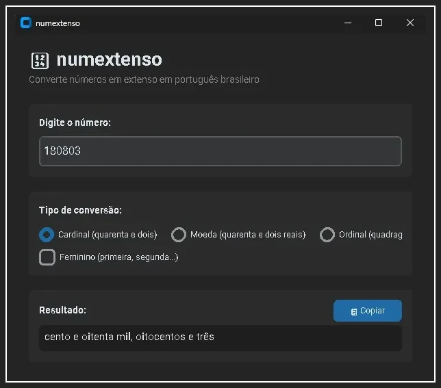

# numextenso 🇧🇷

Biblioteca Python pra converter números em extenso em português brasileiro.

Sabe quando você precisa escrever "mil duzentos e trinta e quatro" num cheque ou fatura? Então, essa biblioteca faz isso pra você.

## Instalação

```bash
pip install numextenso
```

Ou direto do repositório:

```bash
pip install https://github.com/rwbe/numextenso.git
```

## Uso rápido

### No código Python

```python
from numextenso import por_extenso, por_extenso_moeda, por_extenso_ordinal

# Números inteiros
por_extenso(42)          # 'quarenta e dois'
por_extenso(1001)        # 'mil e um'
por_extenso(1000000)     # 'um milhão'
por_extenso(-50)         # 'menos cinquenta'

# Valores em reais
por_extenso_moeda(1234.56)  # 'mil duzentos e trinta e quatro reais e cinquenta e seis centavos'
por_extenso_moeda(0.99)     # 'noventa e nove centavos'

# Ordinais
por_extenso_ordinal(1)                  # 'primeiro'
por_extenso_ordinal(3, feminino=True)   # 'terceira'
por_extenso_ordinal(42)                 # 'quadragésimo segundo'
```

### Na linha de comando

```bash
# Número simples
numextenso 1234
# Saída: mil duzentos e trinta e quatro

# Com moeda
numextenso 99.90 --moeda
# Saída: noventa e nove reais e noventa centavos

# Ordinal
numextenso 5 --ordinal
# Saída: quinto

# Ordinal feminino
numextenso 3 -o -f
# Saída: terceira
```

## GUI (Interface Gráfica)

Tem uma interface gráfica simples pra quem prefere não usar terminal:

```bash
# Instala dependências da GUI
pip install numextenso[gui]

# Roda a interface
python -m numextenso.gui
```



## O que funciona

- ✅ Números de 0 até 999 trilhões
- ✅ Números negativos
- ✅ Moeda brasileira (reais e centavos)
- ✅ Ordinais de 1º a 1000º (masculino e feminino)
- ✅ Casos especiais do português ("cem" vs "cento", "onze" vs "dez e um")
- ✅ Concordância de plural ("um milhão" vs "dois milhões")

## Como funciona

A conversão segue essa lógica:

1. **Quebra o número em grupos de 3 dígitos** (da direita pra esquerda)

   - 1.234.567 → [567, 234, 1]

2. **Converte cada grupo** usando tabelas de palavras

   - 567 → "quinhentos e sessenta e sete"
   - 234 → "duzentos e trinta e quatro"
   - 1 → "um"

3. **Adiciona as classes** (mil, milhão, bilhão...)

   - 567 → "quinhentos e sessenta e sete"
   - 234 → "duzentos e trinta e quatro mil"
   - 1 → "um milhão"

4. **Junta tudo** com conectivos apropriados
   - "um milhão, duzentos e trinta e quatro mil, quinhentos e sessenta e sete"

## Estrutura do Projeto

```
numextenso/
├── numextenso/
│   ├── __init__.py      # Exporta as funções principais
│   ├── constantes.py    # Tabelas de palavras (unidades, dezenas, etc)
│   ├── conversor.py     # Lógica de conversão
│   ├── cli.py           # Interface de linha de comando
│   └── gui.py           # Interface gráfica (opcional)
├── docs/
│   └── COMO_FUNCIONA.md # Explicação detalhada do algoritmo
├── pyproject.toml       # Configuração do projeto
└── README.md
```

## Licença

Este projeto está licenciado sob a licença [MIT](LICENSE). Consulte o arquivo para mais informações.

## Considerações finais

O **numextenso** foi projetado para ser simples de usar e eficiente. Ele cobre as principais funcionalidades que você pode precisar ao trabalhar com números em português, e é facilmente integrável em qualquer projeto Python. Se você encontrar algum problema ou tiver sugestões de melhorias, sinta-se à vontade para abrir um issue ou contribuir para o projeto!
